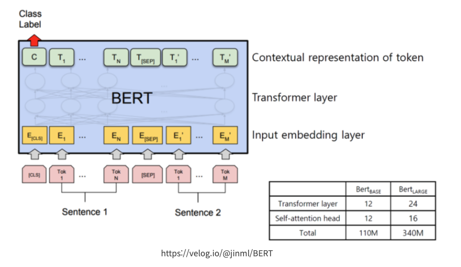
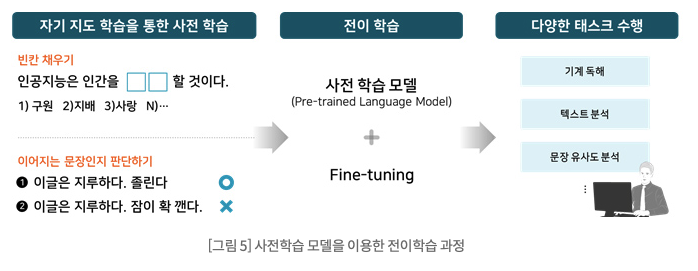
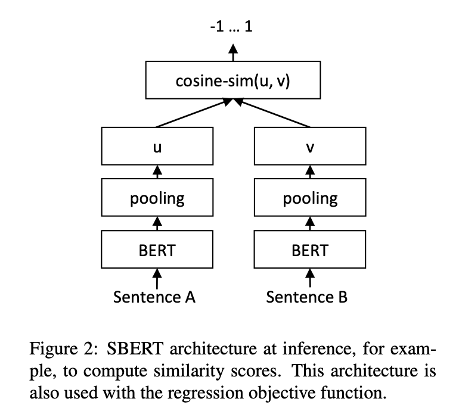
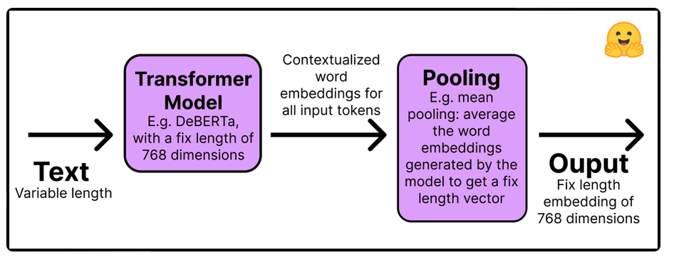

# Semantic Textual Similarity (STS) 및 BERT Output Token Embedding 활용

# 1. 배경 
## 1.1. BERT 구조

아래는 BERT 의 구조 입니다. 기본적인 "자연어 문장1 혹은 문장1 및 문장2" 입력이 되어서 Input Embedding Layer --> Transformer Layer --> Contextual Representation of Token 의 Output 이 제공 됩니다. 또한 이 위에 Downstream Task (예: Classification, Translation, Semantic Textual Similairy, Question & Answering ) 두어서 Transfer Learning (Fine Tuning) 을 통하여 여러 작업을 할 수가 있습니다. 

(참조: 자연어처리_BERT 기초개념(완전 초보용), https://han-py.tistory.com/252)

## 1.2. BERT 모델 훈련 단계

아래는 SDS 의 블로그에서 제공한 "Pre-Training" --> "Transfer Learning" 을 통하여 다양한 Task 를 수행할 수 있는 것을 보여 주고 있습니다. 

(참조: 스마트한 텍스트 분석을 향한 첫걸음, KoreALBERT, 
https://www.samsungsds.com/kr/insights/techtoolkit_2021_korealbert.html)

## 1.3. Sentence-BERT

두개의 문장의 유사도 분석에 많이 사용되는 Sentence-BERT 의 추론 아키텍쳐 입니다.

(참조: 
- Sentence-BERT: Sentence Embeddings using Siamese BERT-Networks
    - https://arxiv.org/abs/1908.10084
- SentenceTransformers Documentation
    - https://www.sbert.net/
)

### Sentence-Transformer 작동 방식

(참조: 
- Train and Fine-Tune Sentence Transformers Models
    - https://huggingface.co/blog/how-to-train-sentence-transformers

# 2. 실습 환경
- [중요] 이 워크샵은 SageMaker Classic Notebook `ml.p3.2xlarge` 에서 테스트 되었습니다. 기타 GPU 가 있는 SageMaker Classic Notebook 의 사용을 권장 합니다. 그리고 로컬의 Storage (EBS) 를 `100 GB` 이상으로 생성해서 사용해주세요.

# 3. 다루는 내용

"3_Training" 폴더의 Semantic Textual Similarity 를 주로 컨텐츠 이지만, Warming-Up 폴더에 다양한 작업에 대한 소개를 하고 있습니다. 

실습은 "1_Setup" --> "2_Warming_Up (스킵 가능)" --> "3_Training" 으로 하시기 바랍니다.

- 1_Setup
    - 0.Set_Environment.ipynb
        - 필요한 Python Package 를 설치 합니다.
- 2_Warming_Up
    - 0.0.Analyze_KoNLPy.ipynb
        - 한국어 Tokenizer (형태소 분석기) 를 소개
    - 1.0.BERT_Tokenizer.ipynb
        - BERT Tokenizer 소개
    - 1.1.BERT_Input_Output.ipynb
        - BERT 추론의 입력 및 출력의 구조를 이해
    - 1.2.Computing_Sentence_Embeddings.ipynb
        - BERT Sentence Embedding 이해
    - 1.3.Semantic_Textual_Similarity.ipynb
        - STS 소개
    - 2.1.KeyBERT.ipynb
        - 문장안에서 Keyword 추출 기술 예시
    - 2.2.ContextTopicBert-hangul.ipynb
        - Context 기반한 토픽 모델링
    - 2.3.BERTopic-Hangul.ipynb
        - BERT + TF-IDF 를 통한 토픽 모델링
    - 3.1.parallel_dask.ipynb        
        - DASK 병렬 처리 프레임워크 소개
- 3_Training
    - 1.1.sbert-training-develop.ipynb 
        - sentence bert 모델 훈련
    - 1.2.sbert-inference-develop.ipynb 
        - sentence bert 모델 추론
        

# Reference:
- 딥 러닝을 이용한 자연어 처리 입문
    - https://wikidocs.net/book/2155
- Sentence-BERT: Sentence Embeddings using Siamese BERT-Networks
    - https://arxiv.org/pdf/1908.10084.pdf
* 논문 설명 - Sentence-BERT : Sentence Embeddings using Siamese BERT-Networks
    * https://mlgalaxy.blogspot.com/2020/09/sentence-bert-sentence-embeddings-using.html
* Jay Alammar. A Visual Guide to Using BERT for the First Time, 
    * http://jalammar.github.io/a-visual-guide-to-using-bert-for-the-first-time
* How the Embedding Layers in BERT Were Implemented
    * 입력이 입베팅으로 변환하는 것을 직관적으로 보여줌
    * https://medium.com/@_init_/why-bert-has-3-embedding-layers-and-their-implementation-details-9c261108e28a
* Understanding BERT — Word Embeddings
    * 버트의 워드 임베팅에 대한 결과 임
    * https://medium.com/@dhartidhami/understanding-bert-word-embeddings-7dc4d2ea54ca
* BERT 톺아보기
    * http://docs.likejazz.com/bert/
* 2018-2020 NLU 연구 동향을 소개합니다
    * https://www.kakaobrain.com/blog/118
* 딥러닝으로 동네생활 게시글 필터링하기
    * https://medium.com/daangn/딥러닝으로-동네생활-게시글-필터링하기-263cfe4bc58d (https://medium.com/daangn/%EB%94%A5%EB%9F%AC%EB%8B%9D%EC%9C%BC%EB%A1%9C-%EB%8F%99%EB%84%A4%EC%83%9D%ED%99%9C-%EA%B2%8C%EC%8B%9C%EA%B8%80-%ED%95%84%ED%84%B0%EB%A7%81%ED%95%98%EA%B8%B0-263cfe4bc58d)
* NLP 실습 텍스트 유사도 - 01 (데이터 EDA 및 전처리)
    * https://heung-bae-lee.github.io/2020/02/10/NLP_10/
* PapersWithCode의 한국어 데이터셋
    * https://smilegate.ai/2021/02/10/paperswithcode-korean-dataset/
* KorNLU Datasets
    * https://github.com/kakaobrain/KorNLUDatasets
* product-matching-model
    * https://github.com/jahyeha/product-matching-model
* Product Matching in eCommerce using deep learning
    * https://medium.com/walmartglobaltech/product-matching-in-ecommerce-4f19b6aebaca
- KoNLPy (한국어 NLP 파이썬 패키지))
    - https://konlpy.org/en/latest/install/
    - 관련 참조
        - https://yuddomack.tistory.com/entry/처음부터-시작하는-EC2-konlpy-mecab-설치하기ubuntu
    
    

---

# Sentence-Transfomer 참고 내용

Multi-Lingual Models
- https://www.sbert.net/docs/pretrained_models.html

The following models generate aligned vector spaces, i.e., similar inputs in different languages are mapped close in vector space. You do not need to specify the input language. Details are in our publication Making Monolingual Sentence Embeddings Multilingual using Knowledge Distillation. We used the following 50+ languages: ar, bg, ca, cs, da, de, el, en, es, et, fa, fi, fr, fr-ca, gl, gu, he, hi, hr, hu, hy, id, it, ja, ka, ko, ku, lt, lv, mk, mn, mr, ms, my, nb, nl, pl, pt, pt-br, ro, ru, sk, sl, sq, sr, sv, th, tr, uk, ur, vi, zh-cn, zh-tw.

Semantic Similarity

These models find semantically similar sentences within one language or across languages:

distiluse-base-multilingual-cased-v1: Multilingual knowledge distilled version of multilingual Universal Sentence Encoder. Supports 15 languages: Arabic, Chinese, Dutch, English, French, German, Italian, Korean, Polish, Portuguese, Russian, Spanish, Turkish.
distiluse-base-multilingual-cased-v2: Multilingual knowledge distilled version of multilingual Universal Sentence Encoder. This version supports 50+ languages, but performs a bit weaker than the v1 model.
paraphrase-multilingual-MiniLM-L12-v2 - Multilingual version of paraphrase-MiniLM-L12-v2, trained on parallel data for 50+ languages.
paraphrase-multilingual-mpnet-base-v2 - Multilingual version of paraphrase-mpnet-base-v2, trained on parallel data for 50+ languages.

